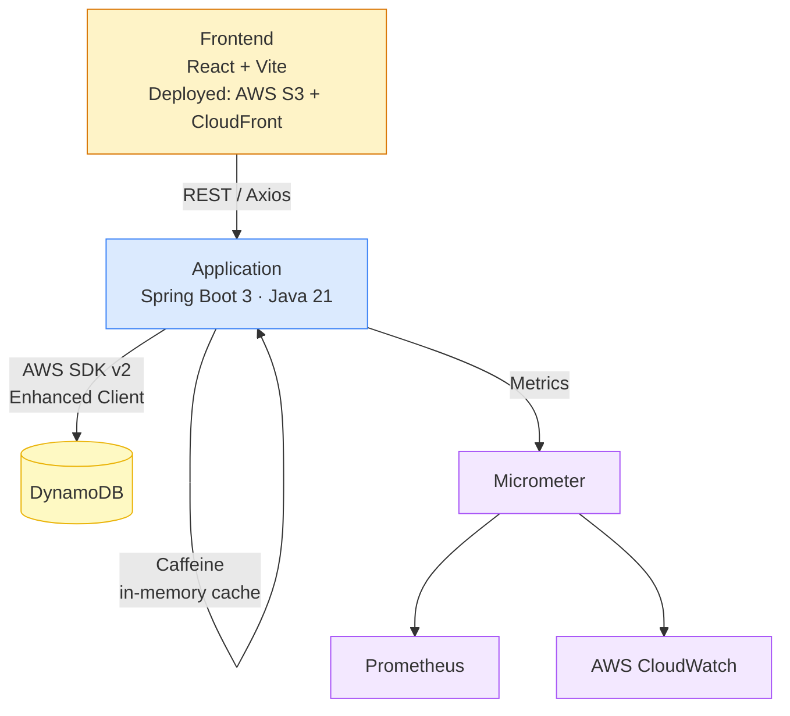
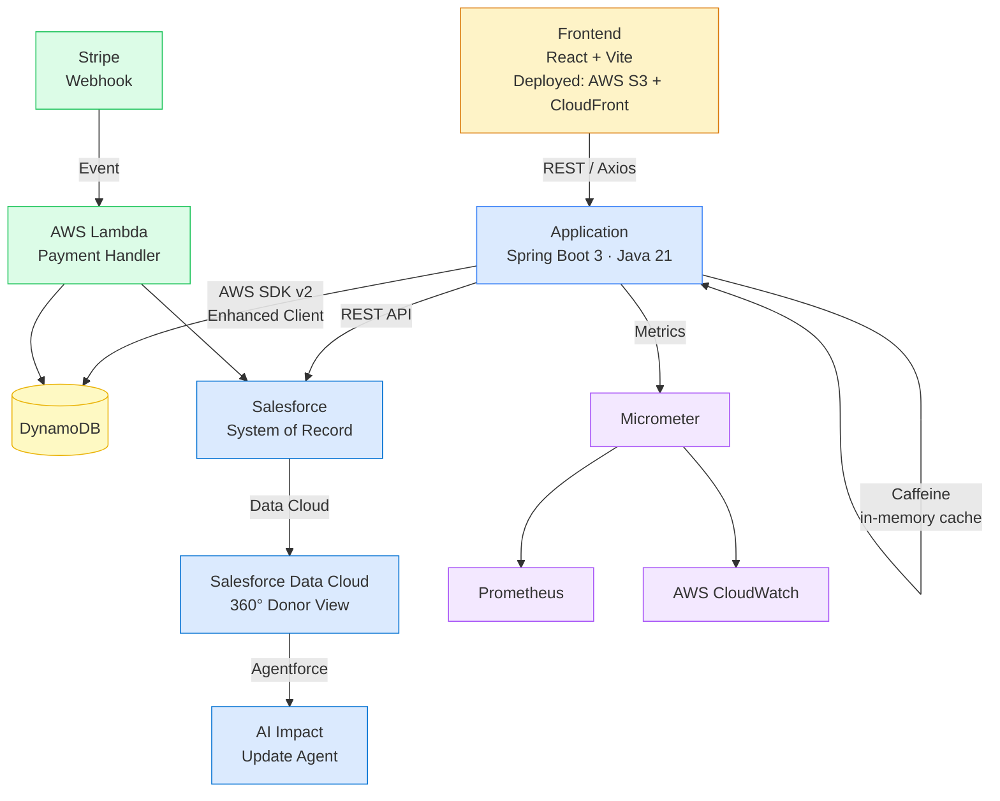

# GenerosityWell

## Overview

GenerosityWell is a **hyperlocal, community-first** fundraising platform designed to empower informal neighborhood groups, local schools, and grassroots nonprofits. Unlike traditional SaaS tools that treat giving time and giving money as separate workflows, GenerosityWell provides a unified hub for **volunteer and donor coordination**, allowing communities to track both financial and sweat-equity contributions in one place.

At its core, the platform is built to eliminate friction and build trust through radical **campaign transparency**. By closing the loop with structured impact reporting, GenerosityWell ensures that every contributor sees exactly how their hours or dollars drove real-world change.

---

## Architecture

### Current State



### Target State (Phase 3 & 4)



---

## Purpose of the Platform & Architecture

This project demonstrates how a modern, cloud-native application can seamlessly integrate with enterprise CRM systems to solve complex business problems. A community platform requires a lightweight, low-friction experience for its end users, but organizers still need robust, enterprise-grade tools to manage the back office. GenerosityWell bridges this gap by separating the public-facing transaction layer from the secure management layer:

- **The Public Interface (Java / Spring Boot / AWS):** A robust, observable API layer and a modern React SPA handle the hyperlocal community experience — processing low-latency Stripe donations, capturing volunteer RSVPs, and displaying public impact reports.
- **The System of Record (Salesforce Integration):** Rather than rebuilding generic CRM features from scratch, the platform syncs all transactional and user data directly into Salesforce via REST API. Salesforce serves as the single source of truth where organizers manage donor relationships and track campaign health.
- **AI-Driven Transparency (Roadmap — Data Cloud & Agentforce):** Future phases will unify donation data in Salesforce Data Cloud to create a 360-degree view of community engagement. This foundation will enable a custom Agentforce agent to automatically draft and propose "Impact Updates" based on real-time campaign data, fulfilling the platform's core mission of transparency with zero administrative overhead.

---

## Project Structure

| Module | Responsibility |
|---|---|
| `Application` | Core Spring Boot API. Handles routing, request validation, Caffeine caching, and observability. Connects directly to DynamoDB via AWS SDK v2 Enhanced Client. |
| `ServiceLambda` | Reserved for Phase 4 — will house the Stripe payment webhook handler. Processes incoming Stripe events asynchronously and writes donation records to DynamoDB and Salesforce. |
| `ServiceLambdaModel` | Shared domain models used across the Lambda boundary. Will be slimmed down to webhook-specific DTOs in Phase 4. |
| `ServiceLambdaJavaClient` | Being removed in Phase 1 completion. The Spring Boot app no longer routes through a Lambda proxy for persistence. |
| `Frontend` | React + Vite SPA. Component-based UI consuming the Spring Boot REST API via Axios. |
| `IntegrationTests` | Cross-module integration test suites backed by Testcontainers. |
| `Utilities` | Shared helper functions and build configurations used across the project. |

---

## Frontend

### Stack

| Tool | Role |
|---|---|
| React 18 | Component-based UI |
| Vite | Replaces Webpack 4; fast dev server with HMR, optimized production builds |
| React Router v6 | Client-side routing (replaces 8 separate HTML files) |
| Axios | HTTP client consuming the Spring Boot REST API (updated from 0.21.x) |
| CSS Modules | Scoped per-component styles (replaces 6 scattered global CSS files) |

### Pages / Routes

| Route | Component | Access |
|---|---|---|
| `/` | `LandingPage` | Public |
| `/login` | `LoginPage` | Public |
| `/register` | `RegisterPage` | Public |
| `/forgot-password` | `ForgotPasswordPage` | Public |
| `/search` | `SearchPage` | Public |
| `/campaigns` | `CampaignsPage` | Public |
| `/campaigns/:id` | `CampaignDetailPage` | Public |
| `/dashboard` | `DashboardPage` | Authenticated |
| `/events` | `EventsPage` | Authenticated |
| `/calendar` | `CalendarPage` | Authenticated |

### Local Development

```bash
cd Frontend
npm install
npm run dev
```

The Vite dev server proxies `/api/*` to `http://localhost:5001`, matching the Spring Boot dev port.

### Build

```bash
npm run build
```

Output is written to `Frontend/dist/` and can be deployed to any static host (AWS S3 + CloudFront recommended).

---

## Building & Running (Backend)

### Local Development

**Prerequisites:**
- Java 21
- Gradle 8.7+
- Docker Desktop (or equivalent container runtime)

**Step 1 — Start local DynamoDB**

```bash
./local-dynamodb.sh
```

**Step 2 — Build and run the Spring Boot application**

```bash
./gradlew :Application:bootRunDev
```

**Step 3 — Explore the API**

The OpenAPI UI is auto-generated and available at: `http://localhost:5001/swagger-ui.html`

> Note: the production profile runs on port 5000.

### Building for Deployment

```bash
./gradlew build
```

---

## Testing

**Unit Tests:** Isolated service logic validation using JUnit and Mockito.

**Integration Tests:** A custom `ApplicationContextInitializer` (`DynamoDbInitializer`) uses Testcontainers to spin up an ephemeral `amazon/dynamodb-local` container, dynamically injecting the mapped port into the Spring context before test startup. This ensures reliable cross-module API testing without requiring a live AWS environment.

```bash
./gradlew :IntegrationTests:test
```

---

## Roadmap

| Phase | Focus | Status |
|---|---|---|
| **Phase 1 — Architecture Stabilization** | Spring Boot 3 / Java 21, AWS SDK v2, direct DynamoDB access, global exception handling, React + Vite frontend | ✅ Complete |
| **Phase 2 — Domain Rename & Model Cleanup** | Rename capstone entities to platform domain, eliminate duplicate models, add Bean Validation, proper date types | 🔄 In Progress |
| **Phase 3 — Feature Completion** | Campaign + event lifecycle, JWT auth / Spring Security, volunteer RSVP, Salesforce integration, frontend auth flow | Planned |
| **Phase 4 — Platform Enhancements** | Stripe donations, Lambda webhook handler, impact reporting, donor dashboard, Salesforce Data Cloud + Agentforce | Planned |
| **Phase 5 — Production Hardening** | CI/CD pipeline, S3 + CloudFront deploy, E2E tests, rate limiting, API Gateway | Planned |

### Phase 1 — Architecture Stabilization ✅

- Spring Boot 3.2.5, Java 21, Gradle 8.7 upgrade
- AWS SDK v2 migration across all modules
- Direct DynamoDB access via Enhanced Client (removed Lambda proxy layer)
- Multi-module Gradle structure established
- Docker-based local DynamoDB dev infrastructure
- Frontend migrated from Webpack 4 / vanilla JS to React + Vite
- Global exception handling with `@RestControllerAdvice`

### Phase 2 — Domain Rename & Model Cleanup 🔄

- Rename `Customer` → `Attendee`; clarify `User` / `Organizer` / `Donor` roles
- Eliminate duplicate models between `Application` and `ServiceLambdaModel`
- Replace broken Spring Data DynamoDB repos with Enhanced Client DAOs
- Add `@Valid` + `@NotBlank` / `@NotNull` to all request DTOs
- Migrate `date` fields from `String` to `LocalDate`
- Migrate `CacheStore` from Guava to Caffeine; unify to a single typed cache
- Remove `ServiceLambdaJavaClient` from Application dependencies

### Phase 3 — Feature Completion

- `Campaign` entity with goal, timeline, and status lifecycle (`DRAFT → ACTIVE → CLOSED`)
- `FundraisingEvent` linked to a Campaign
- Volunteer RSVP flow — attendees can commit time, not just money
- JWT auth / Spring Security — register, login, role-based access (`ORGANIZER`, `DONOR`)
- Salesforce REST API integration — sync users, campaigns, and donations as they are created
- Frontend auth flow — login, register, protected routes, Axios interceptors

### Phase 4 — Platform Enhancements

- `Donation` entity backed by Stripe PaymentIntent API
- AWS Lambda Stripe webhook handler — processes payment events asynchronously
- Structured impact reporting — organizers post updates; donors see their contribution's effect
- Donor dashboard — giving history, volunteer hours, campaigns followed
- Salesforce Data Cloud unification — 360° view of community engagement per organizer
- Agentforce agent — auto-drafts Impact Update posts from real-time campaign data

### Phase 5 — Production Hardening

- GitHub Actions CI/CD — build, test, deploy on merge to main
- AWS S3 + CloudFront for frontend hosting
- API Gateway — rate limiting, CORS, auth header validation
- Playwright or Cypress E2E tests covering the critical donor flow
- CloudWatch dashboards wired via Micrometer for key platform metrics
