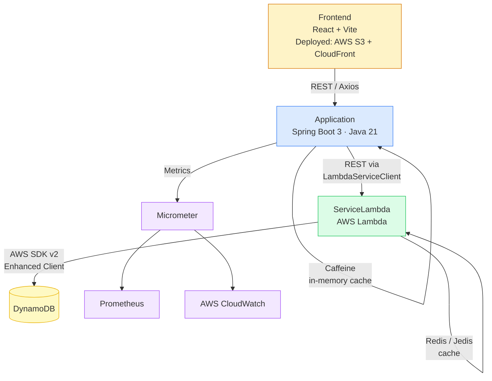

# GenerosityWell

## Overview

GenerosityWell is a nonprofit fundraising and event management platform designed to connect donors, organizers, and communities through structured campaigns and events.

This project is a full-stack refactor of an original academic capstone, evolving it from a tightly coupled proof-of-concept into a cloud-hosted, service-oriented architecture leveraging AWS managed services. The backend is the primary focus — production-ready, observable, and cloud-native. The frontend has been modernized in parallel from a Webpack 4 / vanilla JS static site into a React + Vite SPA that cleanly consumes the Spring Boot REST API.

---

## Architecture



---

## Purpose of the Refactor

The original implementation functioned as a foundational proof-of-concept. This architectural overhaul focuses on:

- **Modernizing the Tech Stack:** Migrated to Spring Boot 3.2.5, Java 21, Gradle 8.7, and AWS SDK v2. Frontend migrated from Webpack 4 / vanilla JS to React 18 + Vite.
- - **Service Boundaries:** Multi-module Gradle project strictly enforcing separation between the API layer, shared client libraries, serverless functions, and the frontend.
  - - **Two-Tier Caching:** In-memory Caffeine caching at the application layer and Redis via Jedis at the Lambda layer.
    - - **Production Observability:** Micrometer, Prometheus, and AWS CloudWatch integrated for metric export and application monitoring.
      - - **Modern Frontend:** React SPA with client-side routing, a shared API service layer (Axios), and component-based UI replacing the previous multi-HTML / per-page JS pattern.
       
        - ---

        ## Project Structure

        | Module | Responsibility |
        |---|---|
        | `Application` | Core Spring Boot API. Handles routing, request validation, Caffeine caching, and observability. |
        | `ServiceLambda` | AWS Lambda functions handling event persistence via DynamoDB. Utilizes Redis/Jedis for caching. |
        | `ServiceLambdaModel` | Shared domain models and DTOs ensuring consistency across service boundaries. |
        | `ServiceLambdaJavaClient` | Dedicated Java client used by the Spring Boot application to interface with the Lambda layer. |
        | `Frontend` | React + Vite SPA. Component-based UI consuming the Spring Boot REST API via Axios. |
        | `IntegrationTests` | Cross-module integration test suites backed by Testcontainers. |
        | `Utilities` | Shared helper functions and build configurations used across the project. |

        ---

        ## Frontend

        ### Stack

        | Tool | Role |
        |---|---|
        | React 18 | Component-based UI |
        | Vite | Replaces Webpack 4; fast dev server with HMR, optimized production builds |
        | React Router v6 | Client-side routing (replaces 8 separate HTML files) |
        | Axios | HTTP client consuming the Spring Boot REST API (updated from 0.21.x) |
        | CSS Modules | Scoped per-component styles (replaces 6 scattered global CSS files) |

        ### Pages / Routes

        | Route | Component | Access |
        |---|---|---|
        | `/` | `LandingPage` | Public |
        | `/login` | `LoginPage` | Public |
        | `/register` | `RegisterPage` | Public |
        | `/forgot-password` | `ForgotPasswordPage` | Public |
        | `/search` | `SearchPage` | Public |
        | `/campaigns` | `CampaignsPage` | Public |
        | `/campaigns/:id` | `CampaignDetailPage` | Public |
        | `/dashboard` | `DashboardPage` | Authenticated |
        | `/events` | `EventsPage` | Authenticated |
        | `/calendar` | `CalendarPage` | Authenticated |

        ### Local Development

        ```bash
        cd Frontend
        npm install
        npm run dev
        ```

        The Vite dev server proxies `/api/*` to `http://localhost:5001`, matching the Spring Boot dev port.

        ### Build

        ```bash
        npm run build
        ```

        Output is written to `Frontend/dist/` and can be deployed to any static host (AWS S3 + CloudFront recommended).

        ---

        ## Building & Running (Backend)

        ### Local Development

        For local development, the Application module runs against a Dockerized DynamoDB instance. The ServiceLambda module requires a deployed AWS environment and is not emulated locally.

        **Prerequisites:**
        - Java 21
        - - Gradle 8.7+
          - - Docker Desktop (or equivalent container runtime)
           
            - **Step 1 — Start local infrastructure**
           
            - ```bash
              # Start Redis (redis-stack image) on port 6379
              ./runLocalRedis.sh

              # Start local DynamoDB on port 8000
              ./local-dynamodb.sh
              ```

              **Step 2 — Build and run the Spring Boot application**

              ```bash
              ./gradlew :Application:bootRunDev
              ```

              **Step 3 — Explore the API**

              The OpenAPI UI is auto-generated and available at: `http://localhost:5001/swagger-ui.html`

              > Note: the production profile runs on port 5000.
              >
              > ### Building for Deployment
              >
              > Build the full project:
              >
              > ```bash
              > ./gradlew build
              > ```
              >
              > Build only the Lambda service artifact (produces `ServiceLambda.zip`):
              >
              > ```bash
              > ./gradlew :ServiceLambda:build
              > ```
              >
              > ### Deploying to AWS
              >
              > Before deploying, configure your environment variables:
              >
              > ```bash
              > source ./setupEnvironment.sh
              > ```
              >
              > Deploy the Lambda service stack to the development environment:
              >
              > ```bash
              > ./deployDev.sh
              > ```
              >
              > This script builds the ServiceLambda artifact, packages it via CloudFormation, and deploys it to AWS Lambda using the stack defined in `LambdaService-template.yml`. Requires AWS CLI configured with appropriate IAM permissions.
              >
              > ---
              >
              > ## Testing
              >
              > **Unit Tests:** Isolated service logic validation using JUnit and Mockito.
              >
              > **Integration Tests:** A custom `ApplicationContextInitializer` (`DynamoDbInitializer`) uses Testcontainers to spin up an ephemeral `amazon/dynamodb-local` container, dynamically injecting the mapped port into the Spring context before test startup. This ensures reliable cross-module API testing without requiring a live AWS environment.
              >
              > ```bash
              > ./gradlew :IntegrationTests:test
              > ```
              >
              > ---
              >
              > ## Roadmap
              >
              > | Phase | Focus | Status |
              > |---|---|---|
              > | **Phase 1 — Architecture Stabilization** | Spring Boot 3 / Java 21 upgrade, multi-module Gradle, Docker dev infra, React+Vite frontend | ✅ In Progress |
              > | **Phase 2 — Feature Completion** | Event lifecycle, JWT auth / Spring Security, campaign linking, frontend auth flow | Planned |
              > | **Phase 3 — Platform Enhancements** | Donations, ticketing, notifications (SES/SNS), donor dashboard, campaign management UI | Planned |
              > | **Phase 4 — Production Hardening** | CI/CD pipeline, S3+CloudFront deploy, E2E tests, rate limiting, API gateway | Planned |
              >
              > ### Phase 1 Detail — Architecture Stabilization
              >
              > Completed:
              >
              > - Spring Boot 3.2.5, Java 21, Gradle 8.7, AWS SDK v2 migration
              > - - Multi-module Gradle structure established
              >   - - Docker-based local dev infrastructure validated (Redis, DynamoDB)
              >     - - Frontend migrated from Webpack 4 / vanilla JS to React + Vite
              >      
              >       - Remaining:
              >      
              >       - - Complete repository layer migration to AWS SDK v2 Enhanced Client
              >         - - Finalize standard DTOs and global exception handling
