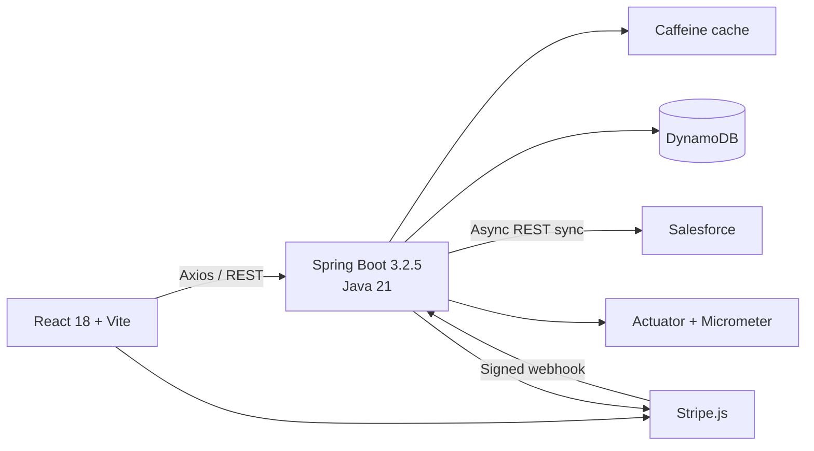

# GenerosityWell

## Overview

GenerosityWell is a hyperlocal, community-first fundraising platform for neighborhood groups, schools, and grassroots nonprofits. It brings campaign fundraising and volunteer coordination into one application so communities can organize financial contributions and time-based support together.

## Current Status: In Development

GenerosityWell is an actively developed portfolio and capstone modernization project. The repository contains working backend and frontend implementations, but it should not be represented as a finished or production-hardened service.

Implemented features include campaign management, fundraising-event workflows, volunteer RSVPs and waitlists, JWT authentication, a donor dashboard, Stripe PaymentIntent processing, signed Stripe webhooks, and asynchronous Salesforce REST synchronization.

Production deployment, persistent donation modeling, full role-based authorization, structured impact reporting, Salesforce Data Cloud, Agentforce, mobile clients, end-to-end testing, and parts of the AWS production architecture remain incomplete or planned.

## Implemented Stack

| Layer | Technology |
|---|---|
| Backend | Java 21, Spring Boot 3.2.5, Gradle 8.7 |
| API | Spring Web, Bean Validation, OpenAPI |
| Authentication | Spring Security, JWT, BCrypt |
| Database | Amazon DynamoDB, AWS SDK v2 Enhanced Client |
| Cache | Caffeine |
| Frontend | React 18, Vite, React Router 6 |
| Client data and forms | Axios, TanStack Query, React Hook Form, Zod |
| UI | Radix UI primitives, CSS Modules |
| Payments | Stripe PaymentIntents and signed webhook handling |
| CRM integration | Salesforce REST API |
| Observability | Spring Actuator, Micrometer, Prometheus and CloudWatch registries |
| Testing | JUnit, Mockito, Testcontainers |
| CI | GitHub Actions |

This project does not use JPA, Hibernate, or a relational application database. Application persistence uses DynamoDB through the AWS SDK v2 Enhanced Client.

## Current Architecture



Stripe webhook handling currently runs in the Spring Boot application. Moving payment-event handling to AWS Lambda is a roadmap item, not current architecture.

## Implemented Product Flows

- User registration and login with stateless JWT authentication
- Campaign creation, retrieval, updates, fundraising totals, and lifecycle status
- Fundraising events linked to campaigns
- Event publishing, cancellation, and organizer ownership checks
- Volunteer RSVP, capacity management, waitlisting, cancellation, and waitlist promotion
- React routes for landing, authentication, search, campaigns, campaign detail, dashboard, events, and calendar
- Authenticated dashboard views for campaigns, organized events, RSVPs, and giving history
- Stripe PaymentIntent creation and client-side payment confirmation
- Stripe signature verification and successful-payment webhook processing
- Asynchronous Salesforce synchronization for contacts, campaigns, and donations
- Append-oriented audit logging for major domain actions

## Repository Structure

| Module | Responsibility |
|---|---|
| `Application` | Spring Boot API, security, DynamoDB access, Stripe, Salesforce integration, caching, and domain services |
| `Frontend` | React 18 and Vite single-page application |
| `IntegrationTests` | Cross-module tests using Testcontainers and DynamoDB Local |
| `ServiceLambda` | Legacy capstone Lambda implementation; not the current Stripe webhook path |
| `ServiceLambdaModel` | Legacy shared models retained during ongoing cleanup |
| `ServiceLambdaJavaClient` | Legacy Lambda client module retained in the repository |
| `Utilities` | Shared build and utility code |
| `curriculum` | Modernization notes and implementation exercises |

The legacy Lambda and shared-model modules remain visible because domain cleanup is still in progress. Their presence should not be read as the current application architecture.

## Frontend

The frontend migration from Webpack and standalone HTML pages has been completed in the committed code. The current frontend uses:

- React 18 and Vite
- React Router 6
- Axios with JWT request and expired-session response interceptors
- TanStack Query
- React Hook Form and Zod
- Radix UI primitives
- CSS Modules
- Stripe React components

```bash
cd Frontend
npm install
npm run dev
```

## Backend Development

Prerequisites:

- Java 21
- Gradle 8.7+
- Docker Desktop or another container runtime

Start DynamoDB Local:

```bash
./local-dynamodb.sh
```

Run the Spring Boot application:

```bash
./gradlew :Application:bootRunDev
```

The local OpenAPI interface is available at `http://localhost:5001/swagger-ui.html` when the application is running.

## Testing and CI

Unit tests cover service behavior with JUnit and Mockito. Integration tests use Testcontainers to launch DynamoDB Local and exercise API behavior against an isolated test database.

```bash
./gradlew :Application:test
./gradlew :IntegrationTests:test
```

GitHub Actions currently compiles and tests the backend and runs frontend linting and formatting checks on pushes and pull requests to `main`.

## Remaining Roadmap

### Domain and authorization cleanup

- Remove or modernize remaining legacy `Customer` and duplicate shared models
- Establish explicit `ORGANIZER` and `DONOR` roles with route-level authorization

### Platform features

- Add a persistent donation entity and transaction history model
- Move Stripe webhook processing to AWS Lambda if the asynchronous architecture is retained
- Add structured impact-report publishing
- Add PWA support
- Integrate Salesforce Data Cloud
- Add an Agentforce impact-update workflow

### Production hardening

- Verify and document the live deployment architecture
- Add API Gateway controls where appropriate
- Add Playwright or Cypress end-to-end coverage
- Complete CloudWatch dashboards and operational alerts

### Additional clients

- React Native and Expo donor/volunteer application
- Salesforce Lightning Web Components for organizer workflows

## Representation Note

This README distinguishes committed implementation from planned work. Dependencies, source files, and tests demonstrate what is present in the repository; roadmap items describe intended direction and should not be presented as completed features.
