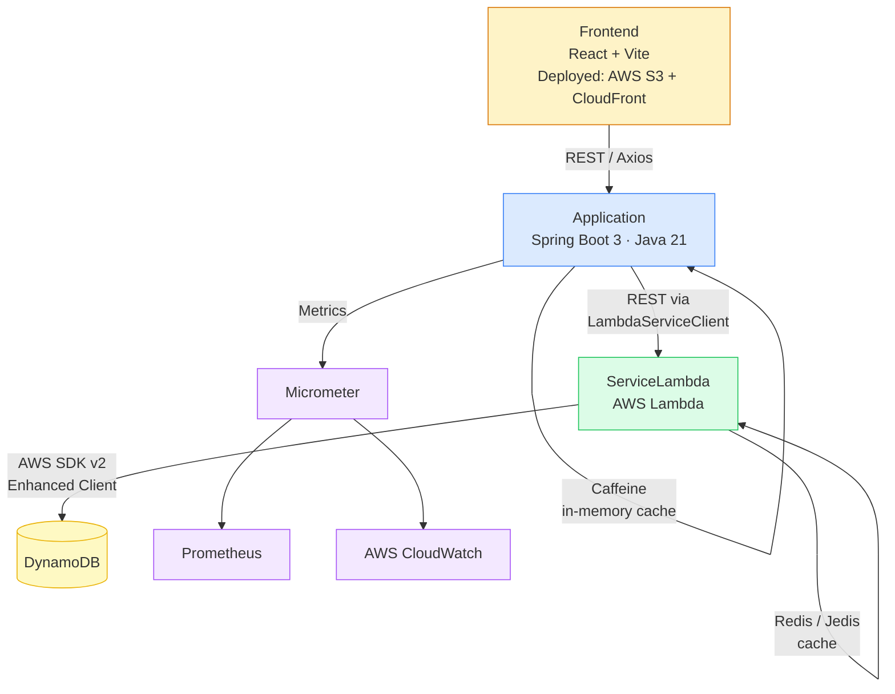

# GenerosityWell

## Overview

GenerosityWell is a **hyperlocal, community-first** fundraising platform designed to empower informal neighborhood groups, local schools, and grassroots nonprofits. Unlike traditional SaaS tools that treat giving time and giving money as separate workflows, GenerosityWell provides a unified hub for **volunteer and donor coordination**, allowing communities to track both financial and sweat-equity contributions in one place. 

At its core, the platform is built to eliminate friction and build trust through radical **campaign transparency**. By closing the loop with structured impact reporting, GenerosityWell ensures that every contributor sees exactly how their hours or dollars drove real-world change.
---

## Architecture



---

## Purpose of the Refactor

his project demonstrates how a modern, cloud-native application can seamlessly integrate with enterprise CRM systems to solve complex business problems. A community platform requires a lightweight, low-friction experience for its end users, but organizers still need robust, enterprise-grade tools to manage the back office. GenerosityWell bridges this gap by separating the public-facing transaction layer from the secure management layer:

* **The Public Interface (Java / Spring Boot / AWS):** A robust, observable API layer and a modern React SPA handle the hyperlocal community experience—processing low-latency Stripe donations, capturing volunteer RSVPs, and displaying public impact reports.
* **The System of Record (Salesforce Integration):** Rather than rebuilding generic CRM features from scratch, the platform syncs all transactional and user data directly into Salesforce via REST API. Salesforce serves as the single source of truth where organizers manage donor relationships and track campaign health.
* **AI-Driven Transparency (Roadmap - Data Cloud & Agentforce):** Future phases will unify donation data in Salesforce Data Cloud to create a 360-degree view of community engagement. This foundation will enable a custom Agentforce agent to automatically draft and propose "Impact Updates" based on real-time campaign data, fulfilling the platform's core mission of transparency with zero administrative overhead.
       
        - ---

        ## Project Structure

        | Module | Responsibility |
        |---|---|
        | `Application` | Core Spring Boot API. Handles routing, request validation, Caffeine caching, and observability. |
        | `ServiceLambda` | AWS Lambda functions handling event persistence via DynamoDB. Utilizes Redis/Jedis for caching. |
        | `ServiceLambdaModel` | Shared domain models and DTOs ensuring consistency across service boundaries. |
        | `ServiceLambdaJavaClient` | Dedicated Java client used by the Spring Boot application to interface with the Lambda layer. |
        | `Frontend` | React + Vite SPA. Component-based UI consuming the Spring Boot REST API via Axios. |
        | `IntegrationTests` | Cross-module integration test suites backed by Testcontainers. |
        | `Utilities` | Shared helper functions and build configurations used across the project. |

        ---

        ## Frontend

        ### Stack

        | Tool | Role |
        |---|---|
        | React 18 | Component-based UI |
        | Vite | Replaces Webpack 4; fast dev server with HMR, optimized production builds |
        | React Router v6 | Client-side routing (replaces 8 separate HTML files) |
        | Axios | HTTP client consuming the Spring Boot REST API (updated from 0.21.x) |
        | CSS Modules | Scoped per-component styles (replaces 6 scattered global CSS files) |

        ### Pages / Routes

        | Route | Component | Access |
        |---|---|---|
        | `/` | `LandingPage` | Public |
        | `/login` | `LoginPage` | Public |
        | `/register` | `RegisterPage` | Public |
        | `/forgot-password` | `ForgotPasswordPage` | Public |
        | `/search` | `SearchPage` | Public |
        | `/campaigns` | `CampaignsPage` | Public |
        | `/campaigns/:id` | `CampaignDetailPage` | Public |
        | `/dashboard` | `DashboardPage` | Authenticated |
        | `/events` | `EventsPage` | Authenticated |
        | `/calendar` | `CalendarPage` | Authenticated |

        ### Local Development

        ```bash
        cd Frontend
        npm install
        npm run dev
        ```

        The Vite dev server proxies `/api/*` to `http://localhost:5001`, matching the Spring Boot dev port.

        ### Build

        ```bash
        npm run build
        ```

        Output is written to `Frontend/dist/` and can be deployed to any static host (AWS S3 + CloudFront recommended).

        ---

        ## Building & Running (Backend)

        ### Local Development

        For local development, the Application module runs against a Dockerized DynamoDB instance. The ServiceLambda module requires a deployed AWS environment and is not emulated locally.

        **Prerequisites:**
        - Java 21
        - - Gradle 8.7+
          - - Docker Desktop (or equivalent container runtime)
           
            - **Step 1 — Start local infrastructure**
           
            - ```bash
              # Start Redis (redis-stack image) on port 6379
              ./runLocalRedis.sh

              # Start local DynamoDB on port 8000
              ./local-dynamodb.sh
              ```

              **Step 2 — Build and run the Spring Boot application**

              ```bash
              ./gradlew :Application:bootRunDev
              ```

              **Step 3 — Explore the API**

              The OpenAPI UI is auto-generated and available at: `http://localhost:5001/swagger-ui.html`

              > Note: the production profile runs on port 5000.
              >
              > ### Building for Deployment
              >
              > Build the full project:
              >
              > ```bash
              > ./gradlew build
              > ```
              >
              > Build only the Lambda service artifact (produces `ServiceLambda.zip`):
              >
              > ```bash
              > ./gradlew :ServiceLambda:build
              > ```
              >
              > ### Deploying to AWS
              >
              > Before deploying, configure your environment variables:
              >
              > ```bash
              > source ./setupEnvironment.sh
              > ```
              >
              > Deploy the Lambda service stack to the development environment:
              >
              > ```bash
              > ./deployDev.sh
              > ```
              >
              > This script builds the ServiceLambda artifact, packages it via CloudFormation, and deploys it to AWS Lambda using the stack defined in `LambdaService-template.yml`. Requires AWS CLI configured with appropriate IAM permissions.
              >
              > ---
              >
              > ## Testing
              >
              > **Unit Tests:** Isolated service logic validation using JUnit and Mockito.
              >
              > **Integration Tests:** A custom `ApplicationContextInitializer` (`DynamoDbInitializer`) uses Testcontainers to spin up an ephemeral `amazon/dynamodb-local` container, dynamically injecting the mapped port into the Spring context before test startup. This ensures reliable cross-module API testing without requiring a live AWS environment.
              >
              > ```bash
              > ./gradlew :IntegrationTests:test
              > ```
              >
              > ---
              >
              > ## Roadmap
              >
              > | Phase | Focus | Status |
              > |---|---|---|
              > | **Phase 1 — Architecture Stabilization** | Spring Boot 3 / Java 21 upgrade, multi-module Gradle, Docker dev infra, React+Vite frontend | ✅ In Progress |
              > | **Phase 2 — Feature Completion** | Event lifecycle, JWT auth / Spring Security, campaign linking, frontend auth flow | Planned |
              > | **Phase 3 — Platform Enhancements** | Donations, ticketing, notifications (SES/SNS), donor dashboard, campaign management UI | Planned |
              > | **Phase 4 — Production Hardening** | CI/CD pipeline, S3+CloudFront deploy, E2E tests, rate limiting, API gateway | Planned |
              >
              > ### Phase 1 Detail — Architecture Stabilization
              >
              > Completed:
              >
              > - Spring Boot 3.2.5, Java 21, Gradle 8.7, AWS SDK v2 migration
              > - - Multi-module Gradle structure established
              >   - - Docker-based local dev infrastructure validated (Redis, DynamoDB)
              >     - - Frontend migrated from Webpack 4 / vanilla JS to React + Vite
              >      
              >       - Remaining:
              >      
              >       - - Complete repository layer migration to AWS SDK v2 Enhanced Client
              >         - - Finalize standard DTOs and global exception handling
