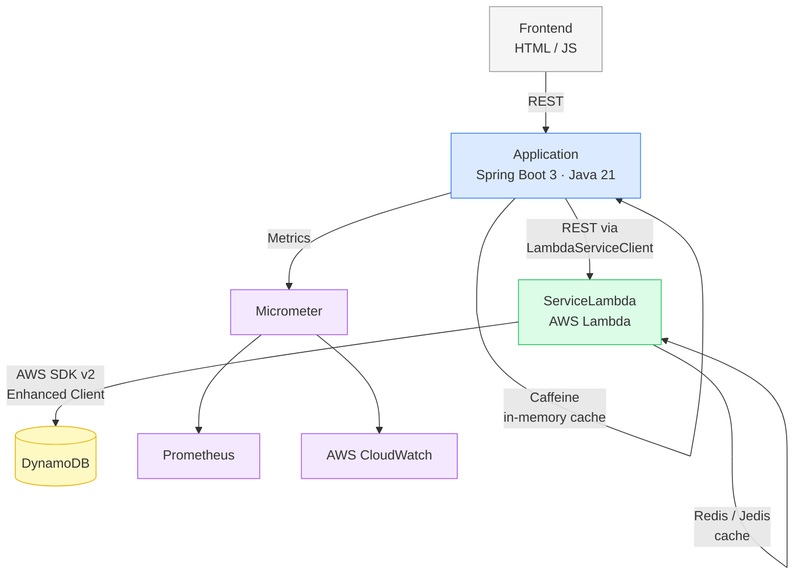

# GenerosityWell

## Overview

GenerosityWell is a nonprofit fundraising and event management platform designed to connect donors, organizers, and communities through structured campaigns and events.

This project is a full-stack refactor of an original academic capstone, evolving it from a tightly coupled proof-of-concept into a cloud-hosted, service-oriented architecture leveraging AWS managed services. The primary goal is establishing a production-ready backend system with clear separation of concerns, containerized local development, and enterprise-grade observability.

---

## Architecture



---

## Purpose of the Refactor

The original implementation functioned as a foundational proof-of-concept. This architectural overhaul focuses on:

**Modernizing the Tech Stack:** Migrated to Spring Boot 3.2.5, Java 21, Gradle 8.7, and AWS SDK v2.

**Service Boundaries:** Implementing a multi-module Gradle project to strictly enforce separation between the API layer, shared client libraries, and serverless functions.

**Two-Tier Caching:** In-memory Caffeine caching at the application layer and Redis via Jedis at the Lambda layer.

**Production Observability:** Micrometer, Prometheus, and AWS CloudWatch integrated for metric export and application monitoring.

---

## Project Structure

The repository is organized as a multi-module Gradle project to enforce clean dependency management and separation of concerns.

| Module | Responsibility |
|---|---|
| `Application` | Core Spring Boot API. Handles routing, request validation, Caffeine caching, and observability. |
| `ServiceLambda` | AWS Lambda functions handling event persistence via DynamoDB. Utilizes Redis/Jedis for caching. |
| `ServiceLambdaModel` | Shared domain models and DTOs ensuring consistency across service boundaries. |
| `ServiceLambdaJavaClient` | Dedicated Java client used by the Spring Boot application to interface with the Lambda layer. |
| `Frontend` | HTML/JS client interfaces. |
| `IntegrationTests` | Cross-module integration test suites backed by Testcontainers. |
| `Utilities` | Shared helper functions and build configurations used across the project. |

---

## Building & Running

### Local Development

For local development, the Application module runs against a Dockerized DynamoDB instance. The ServiceLambda module requires a deployed AWS environment and is not emulated locally.

**Prerequisites:**
- Java 21
- Gradle 8.7+
- Docker Desktop (or equivalent container runtime)

**Step 1 — Start local infrastructure**

```bash
# Start Redis (redis-stack image) on port 6379
./runLocalRedis.sh

# Start local DynamoDB on port 8000
./local-dynamodb.sh
```

**Step 2 — Build and run the Spring Boot application**

```bash
./gradlew :Application:bootRunDev
```

**Step 3 — Explore the API**

The OpenAPI UI is auto-generated and available at:

```
http://localhost:5001/swagger-ui.html
```

Note: the production profile runs on port 5000.

### Building for Deployment

Build the full project:

```bash
./gradlew build
```

Build only the Lambda service artifact (produces `ServiceLambda.zip`):

```bash
./gradlew :ServiceLambda:build
```

### Deploying to AWS

Before deploying, configure your environment variables:

```bash
source ./setupEnvironment.sh
```

Deploy the Lambda service stack to the development environment:

```bash
./deployDev.sh
```

This script builds the ServiceLambda artifact, packages it via CloudFormation, and deploys it to AWS Lambda using the stack defined in `LambdaService-template.yml`. Requires AWS CLI configured with appropriate IAM permissions.

---

## Testing

**Unit Tests:** Isolated service logic validation using JUnit and Mockito.

**Integration Tests:** A custom `ApplicationContextInitializer` (`DynamoDbInitializer`) uses Testcontainers to spin up an ephemeral `amazon/dynamodb-local` container, dynamically injecting the mapped port into the Spring context before test startup. This ensures reliable cross-module API testing without requiring a live AWS environment.

Run integration tests:

```bash
./gradlew :IntegrationTests:test
```

---

## Roadmap

### Phase 1 — Architecture Stabilization (In Progress)

- [x] Migrated to Spring Boot 3.2.5, Java 21, Gradle 8.7, and AWS SDK v2
- [x] Established multi-module Gradle structure
- [x] Validated Docker-based local dev infrastructure (Redis via `runLocalRedis.sh`, DynamoDB via `local-dynamodb.sh`)
- [ ] Complete repository layer migration to AWS SDK v2 Enhanced Client
- [ ] Finalize standard DTOs and global exception handling

### Phase 2 — Feature Completion

- [ ] Event lifecycle management (Create, Update, Cancel)
- [ ] User authentication and authorization
- [ ] Campaign and event linking

### Phase 3 — Platform Enhancements

- [ ] Donation processing workflows
- [ ] Event ticketing and registration
- [ ] Automated notifications (Email/SMS)
