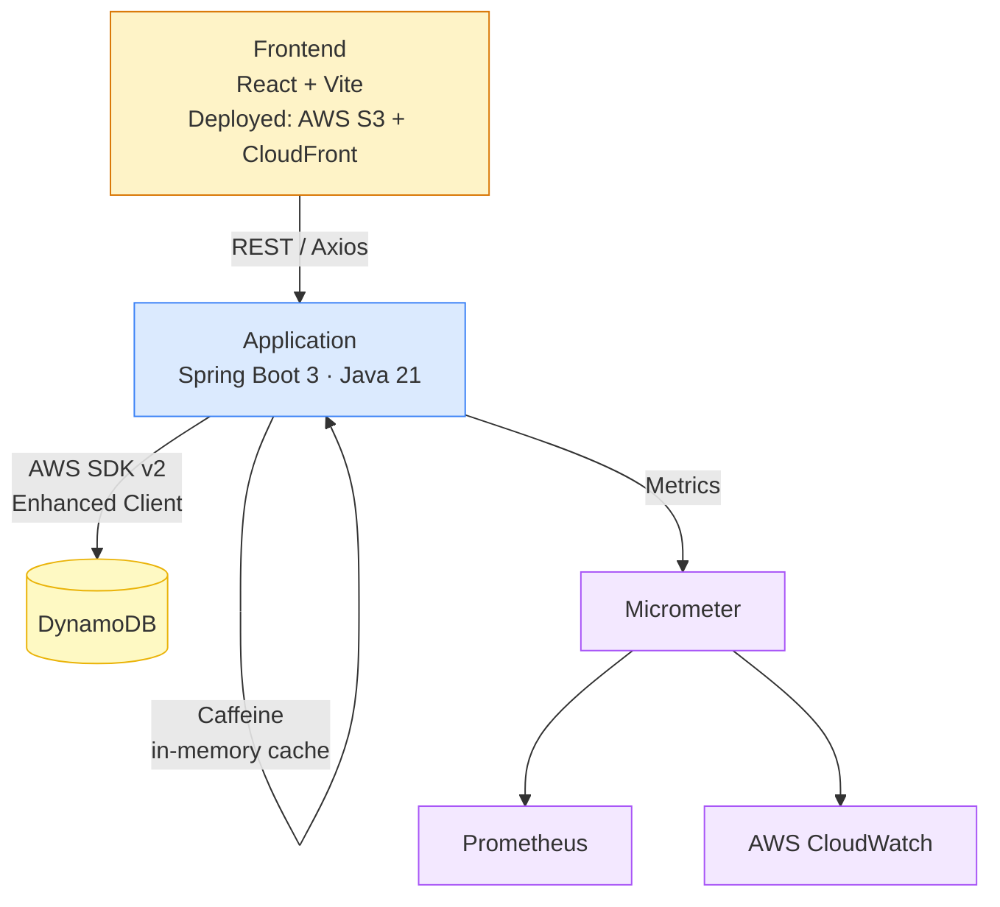
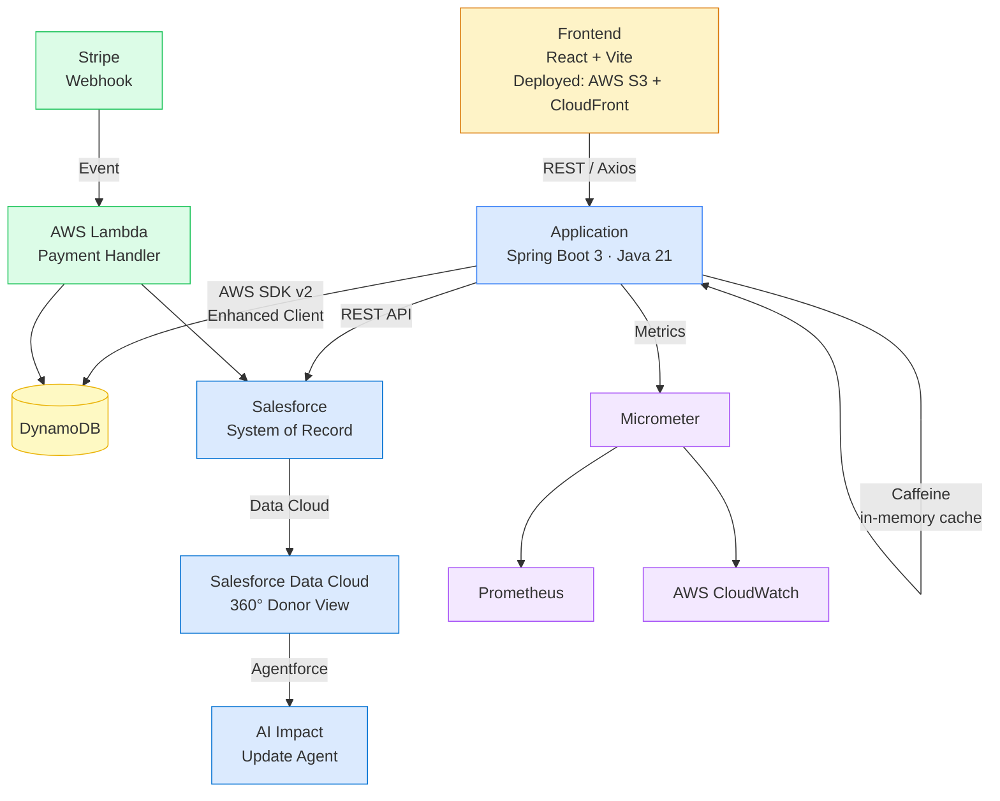

# GenerosityWell

## Overview

GenerosityWell is a **hyperlocal, community-first** fundraising platform designed to empower informal neighborhood groups, local schools, and grassroots nonprofits. Unlike traditional SaaS tools that treat giving time and giving money as separate workflows, GenerosityWell provides a unified hub for **volunteer and donor coordination**, allowing communities to track both financial and sweat-equity contributions in one place.

At its core, the platform is built to eliminate friction and build trust through radical **campaign transparency**. By closing the loop with structured impact reporting, GenerosityWell ensures that every contributor sees exactly how their hours or dollars drove real-world change.

---

## Architecture

### Current State



### Target State (Phase 3 & 4)



---

## Purpose of the Platform & Architecture

This project demonstrates how a modern, cloud-native application can seamlessly integrate with enterprise CRM systems to solve complex business problems. A community platform requires a lightweight, low-friction experience for its end users, but organizers still need robust, enterprise-grade tools to manage the back office. GenerosityWell bridges this gap by separating the public-facing transaction layer from the secure management layer:

- **The Public Interface (Java / Spring Boot / AWS):** A robust, observable API layer and a modern React SPA handle the hyperlocal community experience — processing low-latency Stripe donations, capturing volunteer RSVPs, and displaying public impact reports.
- **The System of Record (Salesforce Integration):** Rather than rebuilding generic CRM features from scratch, the platform syncs all transactional and user data directly into Salesforce via REST API. Salesforce serves as the single source of truth where organizers manage donor relationships and track campaign health.
- **AI-Driven Transparency (Roadmap — Data Cloud & Agentforce):** Future phases will unify donation data in Salesforce Data Cloud to create a 360-degree view of community engagement. This foundation will enable a custom Agentforce agent to automatically draft and propose "Impact Updates" based on real-time campaign data, fulfilling the platform's core mission of transparency with zero administrative overhead.

---

## Project Structure

| Module | Responsibility |
|---|---|
| `Application` | Core Spring Boot API. Handles routing, request validation, Caffeine caching, and observability. Connects directly to DynamoDB via AWS SDK v2 Enhanced Client. |
| `ServiceLambda` | Reserved for Phase 4 — will house the Stripe payment webhook handler. Processes incoming Stripe events asynchronously and writes donation records to DynamoDB and Salesforce. |
| `ServiceLambdaModel` | Shared domain models used across the Lambda boundary. Will be slimmed down to webhook-specific DTOs in Phase 4. |
| `ServiceLambdaJavaClient` | Removed in Phase 1. The Spring Boot app connects directly to DynamoDB via the Enhanced Client — no Lambda proxy. Module retained in the repo tree but excluded from Application dependencies. |
| `Frontend` | React + Vite SPA. Component-based UI consuming the Spring Boot REST API via Axios. |
| `IntegrationTests` | Cross-module integration test suites backed by Testcontainers. |
| `Utilities` | Shared helper functions and build configurations used across the project. |

---

## Frontend

### Current State

The frontend is the original capstone build — Webpack 4, vanilla JS, and 8 separate HTML files. It functions but does not yet use React, component-based routing, or a modern build tool. The React + Vite migration is the first deliverable in Phase 3.

**Current stack:**

| Tool | Version | Note |
|---|---|---|
| Webpack | 4 | Build tool; will be replaced by Vite |
| Vanilla JS | — | No framework; pages are standalone HTML files |
| Axios | 0.21.1 | HTTP client; will be updated |

**Current dev server:**

```bash
cd Frontend
npm install
npm start        # webpack-dev-server on port 8080
```

**Current build:**

```bash
npm run build    # outputs to Frontend/dist/
```

---

### Planned Stack (Phase 3+)

| Tool | Role | Phase |
|---|---|---|
| React 18 | Component-based UI | Phase 3 |
| Vite | Fast dev server with HMR, optimized production builds | Phase 3 |
| React Router v6 | Client-side routing (replaces 8 separate HTML files) | Phase 3 |
| Axios (updated) | HTTP client with JWT interceptors | Phase 3 |
| TanStack Query | Server-state management — caching, background refetch, stale-data invalidation for live donation totals | Phase 3 |
| React Hook Form + Zod | Client-side validation mirroring Spring Boot Bean Validation; Zod schemas shared with the future React Native app | Phase 3 |
| Radix UI | Headless, accessible UI primitives compatible with CSS Modules | Phase 3 |
| CSS Modules | Scoped per-component styles | Phase 3 |
| vite-plugin-pwa | Web app manifest + service worker; "Add to Home Screen" on any device | Phase 4 |

### Planned Pages / Routes (Phase 3)

| Route | Component | Access |
|---|---|---|
| `/` | `LandingPage` | Public |
| `/login` | `LoginPage` | Public |
| `/register` | `RegisterPage` | Public |
| `/forgot-password` | `ForgotPasswordPage` | Public |
| `/search` | `SearchPage` | Public |
| `/campaigns` | `CampaignsPage` | Public |
| `/campaigns/:id` | `CampaignDetailPage` | Public |
| `/dashboard` | `DashboardPage` | Authenticated |
| `/events` | `EventsPage` | Authenticated |
| `/calendar` | `CalendarPage` | Authenticated |

---

## Building & Running (Backend)

### Local Development

**Prerequisites:**
- Java 21
- Gradle 8.7+
- Docker Desktop (or equivalent container runtime)

**Step 1 — Start local DynamoDB**

```bash
./local-dynamodb.sh
```

**Step 2 — Build and run the Spring Boot application**

```bash
./gradlew :Application:bootRunDev
```

**Step 3 — Explore the API**

The OpenAPI UI is auto-generated and available at: `http://localhost:5001/swagger-ui.html`

> Note: the production profile runs on port 5000.

### Building for Deployment

```bash
./gradlew build
```

---

## Testing

**Unit Tests:** Isolated service logic validation using JUnit and Mockito.

**Integration Tests:** A custom `ApplicationContextInitializer` (`DynamoDbInitializer`) uses Testcontainers to spin up an ephemeral `amazon/dynamodb-local` container, dynamically injecting the mapped port into the Spring context before test startup. This ensures reliable cross-module API testing without requiring a live AWS environment.

```bash
./gradlew :IntegrationTests:test
```

---

## Roadmap

| Phase | Focus | Status |
|---|---|---|
| **Phase 1 — Architecture Stabilization** | Spring Boot 3 / Java 21, AWS SDK v2, direct DynamoDB access, global exception handling | ✅ Complete |
| **Phase 2 — Domain Rename & Model Cleanup** | Rename capstone entities to platform domain, eliminate duplicate models, add Bean Validation, proper date types | 🔄 In Progress |
| **Phase 3 — Feature Completion** | React + Vite migration, campaign event lifecycle, JWT auth / Spring Security, volunteer RSVP, Salesforce integration, frontend auth flow | Planned |
| **Phase 4 — Platform Enhancements** | Stripe donations, Lambda webhook handler, impact reporting, donor dashboard, PWA, Salesforce Data Cloud + Agentforce | Planned |
| **Phase 5 — Production Hardening** | CI/CD pipeline, S3 + CloudFront deploy, E2E tests, rate limiting, API Gateway | Planned |
| **Phase 6 — Mobile** | React Native + Expo donor/volunteer app; Salesforce Lightning Web Components for organizer mobile | Planned |

### Phase 1 — Architecture Stabilization ✅

- Spring Boot 3.2.5, Java 21, Gradle 8.7 upgrade
- AWS SDK v2 migration across all modules
- Direct DynamoDB access via Enhanced Client (removed Lambda proxy layer)
- Multi-module Gradle structure established
- Docker-based local DynamoDB dev infrastructure
- Global exception handling with `@RestControllerAdvice`

> **Frontend note:** The frontend is currently the original capstone build (Webpack 4, vanilla JS, 8 separate HTML files). The React + Vite migration is the first item in Phase 3.

### Phase 2 — Domain Rename & Model Cleanup 🔄

- Rename `Customer` → `Attendee`; clarify `User` / `Organizer` / `Donor` roles
- Eliminate duplicate models between `Application` and `ServiceLambdaModel`
- Replace broken Spring Data DynamoDB repos with Enhanced Client DAOs
- Add `@Valid` + `@NotBlank` / `@NotNull` to all request DTOs
- Migrate `date` fields from `String` to `LocalDate`
- Migrate `CacheStore` from Guava to Caffeine; unify to a single typed cache

### Phase 3 — Feature Completion

**Frontend migration (prerequisite for all frontend feature work):**
- Replace Webpack 4 + vanilla JS with React 18 + Vite
- Migrate 8 standalone HTML pages to React components with React Router v6
- Wire Axios with JWT interceptors for authenticated routes
- Add TanStack Query for server-state management
- Add React Hook Form + Zod for client-side form validation
- Add Radix UI headless component primitives

**Backend feature work (largely complete — see Phase 1/2 PRs):**
- ✅ `Campaign` entity with goal, timeline, and status lifecycle (`ACTIVE → FUNDED → CLOSED`)
- ✅ JWT auth / Spring Security — register, login, stateless token validation
- ✅ Salesforce REST API integration — sync users, campaigns, and donations
- `FundraisingEvent` linked to a Campaign
- Volunteer RSVP flow — attendees can commit time, not just money
- Role-based access control (`ORGANIZER`, `DONOR`)

### Phase 4 — Platform Enhancements

- `Donation` entity backed by Stripe PaymentIntent API
- AWS Lambda Stripe webhook handler — processes payment events asynchronously
- Structured impact reporting — organizers post updates; donors see their contribution's effect
- Donor dashboard — giving history, volunteer hours, campaigns followed
- **Progressive Web App (PWA)** — `vite-plugin-pwa` adds a web app manifest and service worker to the existing React/Vite SPA; donors and volunteers can "Add to Home Screen" on any device without an app store; eliminates friction for one-time contributors
- Salesforce Data Cloud unification — 360° view of community engagement per organizer
- Agentforce agent — auto-drafts Impact Update posts from real-time campaign data

### Phase 5 — Production Hardening

- ✅ GitHub Actions CI — build and unit tests run on every PR and push to main
- AWS S3 + CloudFront for frontend hosting
- API Gateway — rate limiting, CORS, auth header validation
- Playwright or Cypress E2E tests covering the critical donor flow
- CloudWatch dashboards wired via Micrometer for key platform metrics

### Phase 6 — Mobile

Two tracks targeting distinct user groups — built to share maximum logic with the existing web frontend.

**Donor & Volunteer App (React Native + Expo)**
- Expo abstracts iOS (Xcode) and Android (Android Studio) build complexity
- Reuses the Zod validation schemas, Axios API client, and JWT auth flow from the web frontend
- TanStack Query for server-state management is identical API surface on React Native
- Core flows: browse campaigns, donate (Stripe), volunteer RSVP, push notifications for campaign milestones

**Organizer App (Salesforce Lightning Web Components)**
- Organizers already live in Salesforce — no separate app download required
- Custom LWCs expose campaign health, donation velocity, and volunteer pipeline directly in the Salesforce Mobile App
- As Data Cloud and Agentforce integrations land (Phase 4), LWC surfaces the AI-drafted Impact Updates for organizer review and one-tap publish
- Zero additional deployment infrastructure: LWCs deploy as part of the Salesforce org
