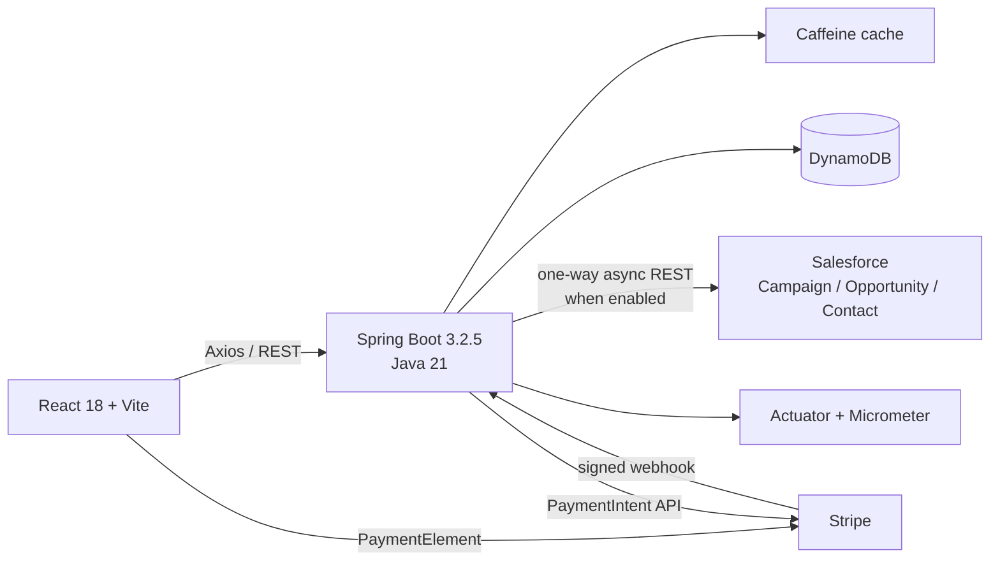
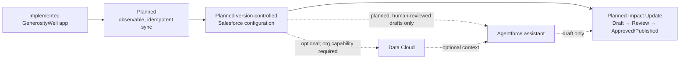

# GenerosityWell

GenerosityWell is a portfolio fundraising platform for coordinating campaigns,
donations, events, and volunteer participation. It is an actively developed
application, not a production service or a record of real nonprofit activity.

## Project status

This documentation uses four status labels:

- **Implemented** — code or configuration is present in this repository.
- **Validated** — the implementation also has repository-based automated or
  reproducible verification. This does not mean production-validated.
- **Planned** — the capability is a design or roadmap item, not an implemented feature.
- **Optional/blocked by org capability** — the work depends on Salesforce editions,
  licenses, or features that have not been confirmed in the portfolio org.

| Area                                                                                             | Status                                 | Evidence and limits                                                                                                                         |
| ------------------------------------------------------------------------------------------------ | -------------------------------------- | ------------------------------------------------------------------------------------------------------------------------------------------- |
| Spring Boot API, DynamoDB access, caching, JWT auth, campaigns, events, RSVPs, and audit logging | **Implemented**                        | Source and unit tests are present; this is not a production-readiness claim.                                                                |
| React 18/Vite application and dashboard flows                                                    | **Validated**                          | The frontend is built in `Frontend/`; CI runs lint and format checks, and the documented local check includes a production build.           |
| Stripe PaymentIntent, PaymentElement, and signed Spring webhook flow                             | **Implemented**                        | Code is present in both application layers. Live deployment and end-to-end production operation have not been validated.                    |
| One-way Salesforce REST synchronization                                                          | **Implemented**                        | The backend creates Campaign, Opportunity, and Contact records. Actual-org compatibility and end-to-end operation still require validation. |
| Structured impact reporting                                                                      | **Planned**                            | No application model, workflow, or Salesforce metadata is committed.                                                                        |
| Agentforce impact-update assistant                                                               | **Planned**                            | Any future draft must require human review before publication.                                                                              |
| Salesforce Data Cloud                                                                            | **Optional/blocked by org capability** | No data streams or Data Cloud metadata are committed.                                                                                       |
| Public AWS deployment                                                                            | **Planned**                            | The repository does not provide evidence of a currently operating S3/CloudFront or backend deployment.                                      |

## Project provenance

GenerosityWell began as a Kenzie Academy/Southern New Hampshire University team
capstone in 2022. The original application was collaborative work. Original
contributors visible in the repository history include Stacey Spears, Robert
Andris, Jordan Hanson, and Amed Espinosa; individual contributions should be
attributed from commits rather than inferred from the current codebase.

The independent GenerosityWell modernization is dated **March 2026–Present**.
Stacey Spears directed, reviewed, tested, integrated, and documented the later
work supported by repository history. That work does not imply sole authorship
of the original capstone. Development has been AI-assisted; credited work is
based on human judgment and verifiable repository evidence, not generated-code
volume.

The project uses synthetic development data only. It does not claim nonprofit
adoption, real donor volume, business outcomes, or production payment activity.

## Implemented stack

| Layer                    | Technology                                                                  |
| ------------------------ | --------------------------------------------------------------------------- |
| Backend                  | Java 21, Spring Boot 3.2.5, Gradle 8.7                                      |
| API                      | Spring Web, Bean Validation, OpenAPI                                        |
| Persistence              | Amazon DynamoDB, AWS SDK v2 Enhanced Client                                 |
| Cache                    | Caffeine                                                                    |
| Authentication           | Spring Security, JWT, BCrypt                                                |
| Frontend                 | React 18, Vite, React Router 6, CSS Modules                                 |
| Client data and forms    | Axios, TanStack Query, React Hook Form, Zod                                 |
| UI                       | Radix UI primitives                                                         |
| Payments                 | Stripe PaymentIntents, React Stripe PaymentElement, signed webhook handling |
| CRM seam                 | Salesforce REST API using client-credentials OAuth                          |
| Audit                    | Append-only DynamoDB audit log with entity and actor indexes                |
| Observability foundation | Spring Actuator, Micrometer, Prometheus and CloudWatch registries           |
| CI                       | GitHub Actions backend tests plus frontend lint and format checks           |

Application persistence uses DynamoDB; the current application does not use JPA,
Hibernate, or a relational database.

## Architecture

### Current repository architecture



The diagram describes code in the repository, not a verified public deployment.
The Spring webhook controller is the implemented Stripe webhook path; the legacy
Lambda modules are not the current payment path.

Representative evidence: [`StripeService`](Application/src/main/java/com/kenzie/appserver/service/StripeService.java),
[`StripeWebhookController`](Application/src/main/java/com/kenzie/appserver/controller/StripeWebhookController.java),
and [`StripePaymentForm`](Frontend/src/pages/CampaignDetailPage/StripePaymentForm.jsx).

### Target Salesforce portfolio extension



Data Cloud and Agentforce are not part of the current implementation. An AI
assistant may eventually draft an impact update, but it must not publish an
update, change donation records, or take financial action. A person must review
and approve every draft before publication.

## Salesforce REST seam

The disabled-by-default integration uses client-credentials OAuth and performs
one-way, asynchronous writes:

- local campaign → Salesforce `Campaign`;
- recorded donation → Salesforce `Opportunity`;
- registered user → Salesforce `Contact`.

Implementation evidence: [`SalesforceTokenService`](Application/src/main/java/com/kenzie/appserver/salesforce/SalesforceTokenService.java),
[`SalesforceClient`](Application/src/main/java/com/kenzie/appserver/salesforce/SalesforceClient.java),
and [`SalesforceService`](Application/src/main/java/com/kenzie/appserver/salesforce/SalesforceService.java).

The current mapping uses those concrete standard objects and fields; it is not
evidence of NPSP or current Nonprofit Cloud compatibility. Configuration currently
defaults to API `v59.0`, but the version and field mappings must be confirmed in
the actual portfolio org before they are described as org-validated.

Failures are caught and logged so they do not fail the user-facing request. There
is no durable retry queue, outbox, sync-status model, demonstrated idempotency key,
or guaranteed-delivery claim. See
[`curriculum/11-salesforce-integration.md`](curriculum/11-salesforce-integration.md)
for the implementation boundary and hardening backlog.

Credentials belong in environment or secret storage. Never commit Salesforce
auth files, access tokens, org credentials, real constituent data, Stripe secrets,
or payment data.

## Repository structure

| Path                      | Responsibility                                                                                    |
| ------------------------- | ------------------------------------------------------------------------------------------------- |
| `Application`             | Spring Boot API, DynamoDB access, security, Stripe, Salesforce sync, caching, audit, and services |
| `Frontend`                | React 18/Vite single-page application                                                             |
| `IntegrationTests`        | Cross-module Testcontainers tests retained from the capstone and modernization                    |
| `ServiceLambda`           | Legacy capstone Lambda implementation; not the current Stripe webhook path                        |
| `ServiceLambdaModel`      | Legacy shared models retained during cleanup                                                      |
| `ServiceLambdaJavaClient` | Legacy Lambda client retained in the repository                                                   |
| `Utilities`               | Shared build and utility code                                                                     |
| `curriculum`              | Modernization notes, current implementation boundaries, and planned exercises                     |

## Local development and verification

Prerequisites: Java 21, Node.js/npm, and Docker or another compatible container
runtime for DynamoDB Local and integration tests.

```bash
# Backend
./local-dynamodb.sh
./gradlew :Application:bootRunDev

# Frontend, in another terminal
cd Frontend
npm ci
npm run dev
```

When the backend is running locally, OpenAPI is available at
`http://localhost:5001/swagger-ui.html`.

Before a change is pushed, run the repository-required checks:

```bash
./gradlew :Application:test
cd Frontend
npm run lint
npm run build
```

CI additionally runs backend compilation/tests and the frontend Prettier check.
Integration tests can be run separately with `./gradlew :IntegrationTests:test`.

## Security and production-hardening boundary

JWTs are currently stored in browser `localStorage`. This is an acknowledged XSS
exposure and must be revisited before public deployment. See [`SECURITY.md`](SECURITY.md)
for the current decision and the HttpOnly-cookie/CSRF hardening target.

Other planned hardening includes Salesforce integration tests and observable sync
status, idempotency and bounded retry or a durable outbox, secret-managed org
configuration, end-to-end payment tests, rate limiting, deployment verification,
and operational dashboards.

## Portfolio roadmap

| Workstream                                                                      | Status                                         |
| ------------------------------------------------------------------------------- | ---------------------------------------------- |
| Reconcile public documentation with repository evidence                         | **Implemented** in this documentation baseline |
| Salesforce token/client/mapping/error-path tests                                | **Planned**                                    |
| Observable sync state, external IDs, idempotency, and delivery strategy         | **Planned**                                    |
| Salesforce DX metadata under `salesforce/` with an architecture decision record | **Planned**                                    |
| Synthetic Salesforce sample-data setup and reset scripts                        | **Planned**                                    |
| Impact Update approval Flow, permissions, reports, and dashboards               | **Planned**                                    |
| Agentforce draft assistant                                                      | **Planned** and dependent on a capable org     |
| Data Cloud-backed context                                                       | **Optional/blocked by org capability**         |

Portfolio claims should link to public code, metadata, tests, diagrams, or synthetic
demo evidence. Seeded or synthetic results must always be labeled as demo/test data.
